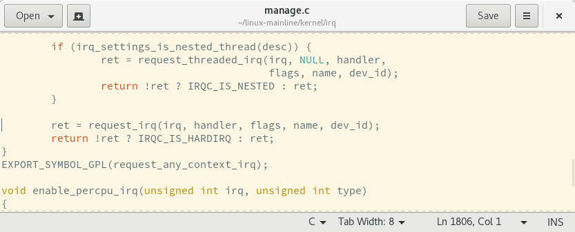
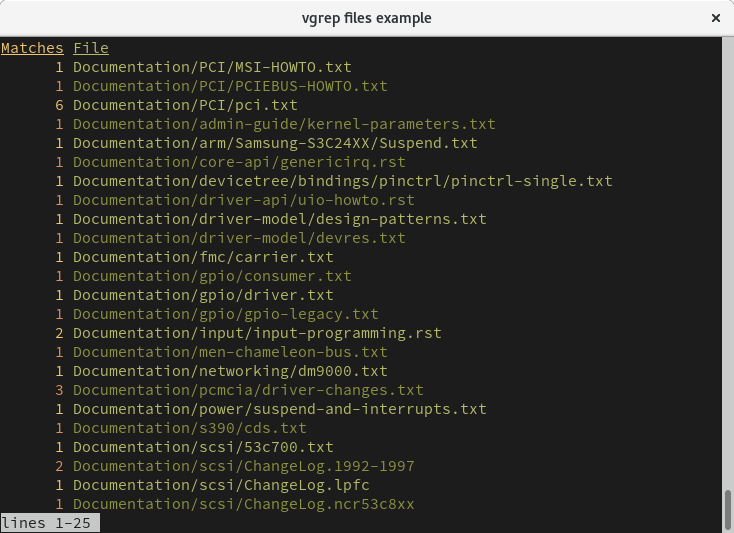

# vgrep

**vgrep** is a command-line tool to search textual patterns in directories. It serves as a frontend to grep and git-grep and allows to open the indexed matching lines in a user-specified editor.  vgrep is inspired by the ancient **cgvg** scripts but extended to perform further operations such as listing statistics of files and directory trees or showing the context lines before and after the matches.

Please, feel free to copy, improve, distribute and share.  Feedback and patches are always welcome!

Notice for packaging: To ease packaging, vgrep ships all external dependencies in the `vendor/` directory. If you have no prior experience in building packages in golang, feel free to checkout and use the `buildInContainer` make target (requires docker).

## NEWS - vgrep has moved to golang (no official release yet)
The old vgrep implementation in Python can be found in the "python" branch for historical reasons. The main changes include:

 - The `--no-git-submodules` flag has been removed as git-grep supports recursing into submodules (see ``--recurse-submodules``) since git v2.12.
 - The code highlighting of context lines (`--show c`) has been dropped as pygments doesn't perform well with some widely used color schemes, such as solarized.  Code highlighting may be re-added in a future release.
 - The grammar to execute vgrep commands has changed from ``[selectors] command`` to ``command[context] [selectors]``.  This change was necessary to discriminate context lines from selectors, what did not work properly before.  Extending the selectors also doesn't require to delete the entire line anymore.
 - Regex selectors were broken and have been removed for now.  As vgrep pipes its output to `less`, there are various alternatives to further search in and navigate through the output.
 - The versioning scheme changed from the Ubuntu-like versioning of ``month.year-patch`` to semantic versioning of ``major.minor.patch``.  Please refer to http://semver.org/ to read about the benefits of this versioning scheme.

There are two main reasons for having ported vgrep from Python to golang.  First, although the previous code base was Python on steroids, the language has certain performance penalties that became a bottleneck when operating on large amounts of data; the implementation in golang is several factors faster and easier to maintain. Second, althouth there are valid arguments to use even more performant programming languages than golang, such as C, C++ or Rust, but C and C++ are hard to maintain dinosaurs and I simply prefer golang over Rust.

Please open an issue in case you experience any troubles after upgrading to the golang version.

# Searching patterns
The basic functionality of vgrep is to perform textual searches. On a technical level, vgrep serves as a frontend to grep or git-grep when invoking vgrep inside a git tree.  All non-vgrep flags and arguments will be passed along to either grep or git-grep.  The command `$vgrep -w foo`, for instance, will only print matching lines where `foo` forms a whole word as the `-w` flag will be passed to grep or git-grep. Notice, that the matching lines of the last querry are cached, so running vgrep without a new query will load previous results and operate on them.

An example call may look as follows:


By default, the output will be written to `less` to make browsing large amounts of data more comfortable.

# Opening matches in an editor
vgrep can open matched lines in the editor specified by the `EDITOR` environment variable (default=vim). Opening one of the matched lines from the previous example may look as follows:

```
# export EDITOR=gedit
# vgrep --show 4
```



Please note, as the default editor of vgrep is vim, the defautl flag to open a file at a specific line is ``+`` followed by the line number.  If your editor of choice hits the rare case of a different syntax, use the `EDITORLINEFLAG` environment variable to adjust.  For example, `kate` user may set the environment to ``EDITOR="kate"`` and ``EDITORLINEFLAG="-l"``.

# vgrep commands and the interactive shell

Once vgreped, you can perform certain operations on the results such as limiting the range of indexed matches, listing matching files and directories, etc.
```
Enter a vgrep command: ?
vgrep command help: command[context lines] [selectors]
         selectors: '3' (single), '1,2,6' (multi), '1-8' (range)
          commands: print, show, context, tree, delete, files, quit, ?
```
The vgrep commands can be passed directly to the ``--show/-s`` flag, for instance as ``--show "c5 1-10"`` to show the five context lines of the first then matched lines.  Futhermore, the commands can be executed in an interactive shell via the ``--interactive/-i`` flag. Running ``vgrep --interactive`` will enter the shell directly, ``vgrep --show 1 --interactive`` will first open the first matched line in the editor and enter the interactive shell after.

vgrep supports the following commands:

- ``print`` to limit the range of matched lines to be printed. ``p 1-12,20`` prints the first 12 lines and the 20th line.
- ``show`` to open the selectors in an user-specified editor (requires selectors).
- ``context`` to print the context lines before and after the matched lines. ``c10 3-9`` prints 10 context lines of the matching lines 3 to 9.  Unless specified, vgrep will print 5 context lines.
- ``tree`` to print the amount of matches for each directory in the tree.
- ``files`` will print the amount of matches for each file in the tree.
- ``quit`` to exit the interactive shell.
- ``?`` to show the help for vgrep commands.

# vgrep command examples

## Context lines


## Tree


## Files

